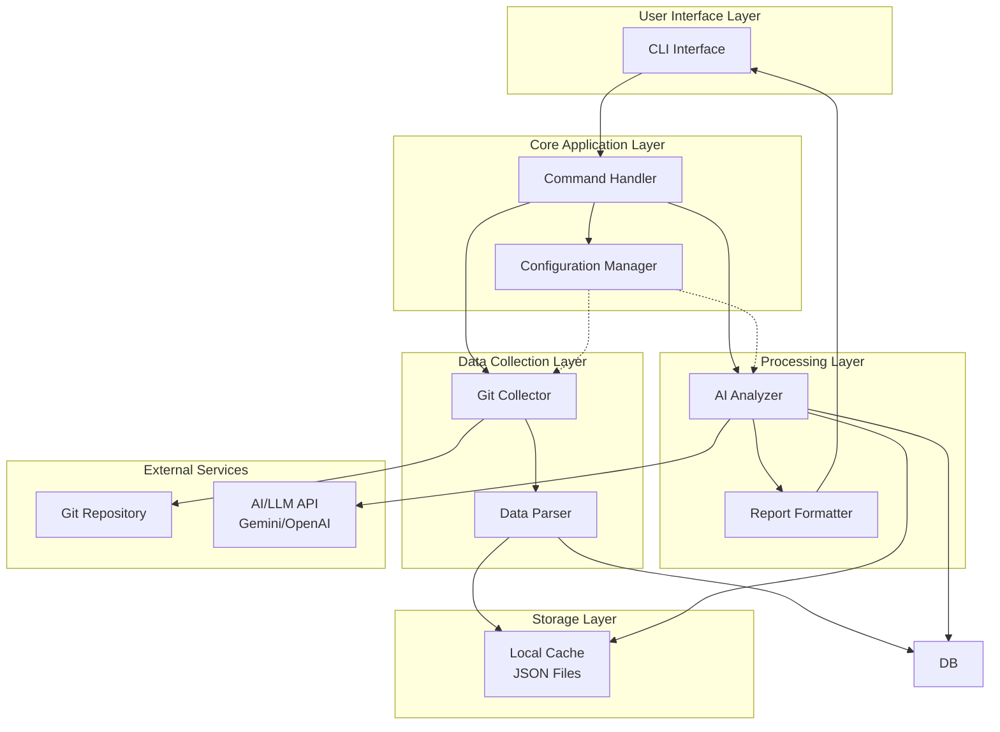
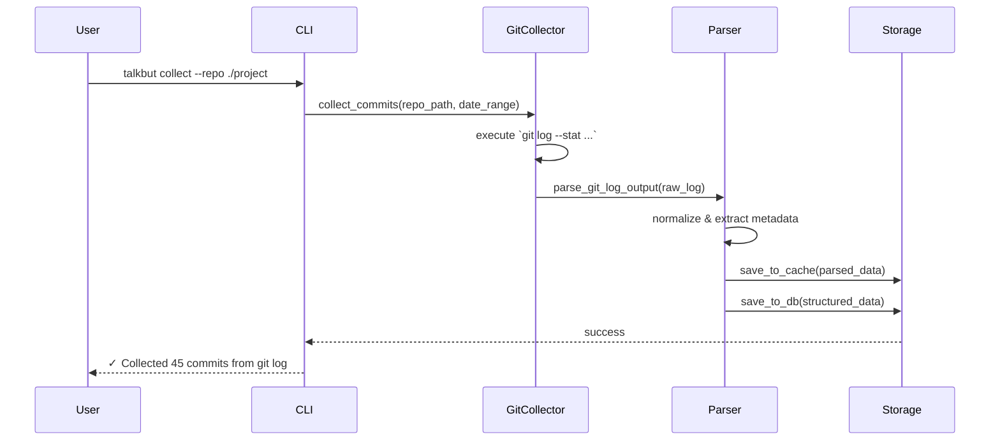
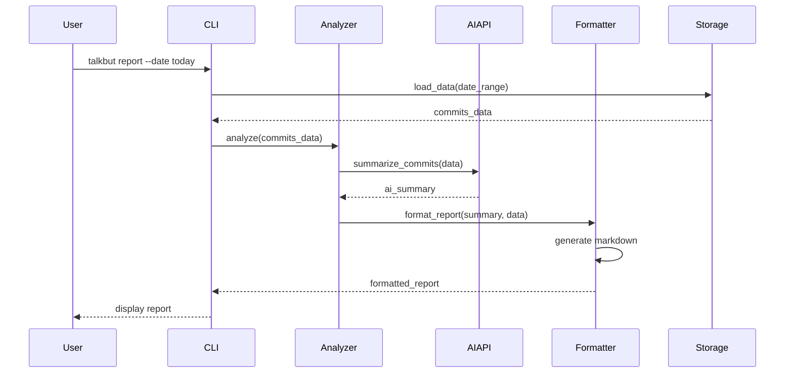

# TalkBut MVP Architecture

## Overview
TalkBut MVP เป็น Python-based command-line tool ที่ออกแบบมาเพื่อเก็บรวบรวมข้อมูลการทำงานจาก Git repositories โดยใช้คำสั่ง `git log` เพื่อดึงประวัติการทำงานอย่างละเอียด และใช้ AI ในการวิเคราะห์และสรุปผลงานสำหรับ software developers

## Architecture Diagram



## Component Design

### 1. CLI Interface (`cli/`)
**หน้าที่**: จัดการ command-line interface และ user interactions

**คำสั่งหลัก**:
- `talkbut collect` - เก็บข้อมูลจาก git repository
- `talkbut analyze` - วิเคราะห์ข้อมูลด้วย AI
- `talkbut report` - สร้างรายงานสรุป
- `talkbut config` - จัดการ configuration

**เทคโนโลยี**: Click หรือ Typer (Python CLI frameworks)

### 2. Configuration Manager (`core/config.py`)
**หน้าที่**: จัดการ configuration และ settings

**การตั้งค่าที่รองรับ**:
- Git repository paths
- AI API keys และ settings
- Report templates
- Storage locations
- Time ranges สำหรับการเก็บข้อมูล

**รูปแบบ**: YAML หรือ JSON configuration file

### 3. Git Collector (`collectors/git_collector.py`)
**หน้าที่**: ดึงข้อมูลจาก Git repositories โดยใช้ `git log`

**การทำงาน**:
- ใช้ `git log` command (ผ่าน GitPython) เพื่อดึงประวัติการทำงาน
- รองรับ parameters: `--since`, `--until`, `--author`, `--all` (branches)
- ดึงข้อมูลแบบละเอียดด้วย `--stat` หรือ `--patch` เพื่อดูการเปลี่ยนแปลงของไฟล์

**ข้อมูลที่เก็บจาก git log**:
- Commit hash (full & short)
- Author name & email
- Date (timestamp)
- Commit message (Subject & Body)
- Changed files stats (insertions/deletions)
- Branch information (`--source`)

### 4. Data Parser (`collectors/parser.py`)
**หน้าที่**: แปลงและจัดรูปแบบข้อมูลดิบจาก Git

**การประมวลผล**:
- Normalize commit messages
- Extract metadata (ticket numbers, tags)
- Categorize changes by file type
- Calculate statistics

### 5. AI Analyzer (`processors/ai_analyzer.py`)
**หน้าที่**: ใช้ AI ในการวิเคราะห์และสรุปข้อมูล

**ความสามารถ**:
- สรุป commit messages เป็นภาษาที่เข้าใจง่าย
- จัดหมวดหมู่งานตามประเภท (feature, bugfix, refactor)
- ระบุ patterns และ trends
- สร้าง insights และ recommendations

**AI Provider**: Google Gemini API (หรือ OpenAI GPT)

### 6. Report Formatter (`processors/formatter.py`)
**หน้าที่**: จัดรูปแบบผลลัพธ์เป็นรายงาน

**รูปแบบ output**:
- Markdown report
- JSON data
- Plain text summary
- HTML report (optional)

### 7. Storage Layer
**Local Cache** (`storage/cache/`):
- เก็บ raw data จาก Git
- Cache AI responses
- รูปแบบ: JSON files

## Data Flow

### Scenario 1: เก็บข้อมูลจาก Git


### Scenario 2: วิเคราะห์และสร้างรายงาน


## Technology Stack

### Core
- **Python 3.10+**: ภาษาหลัก
- **Click/Typer**: CLI framework
- **GitPython**: Git integration

### AI/ML
- **Google Gemini API**: AI analysis (primary)
- **OpenAI API**: Alternative option
- **LangChain**: AI orchestration (optional)

### Data Processing
- **Pandas**: Data manipulation (optional)
- **python-dateutil**: Date handling
- **PyYAML**: Configuration files

### Storage
- **JSON**: Cache storage

### Development
- **pytest**: Testing
- **black**: Code formatting
- **ruff**: Linting
- **mypy**: Type checking

## File Structure

```
TalkBut/
├── README.md
├── idea.txt
├── pyproject.toml          # Project dependencies (Poetry/pip)
├── .env.example            # Environment variables template
├── .gitignore
│
├── docs/
│   ├── architecture_mvp.md
│   ├── user_guide.md
│   └── api_reference.md
│
├── src/
│   └── talkbut/
│       ├── __init__.py
│       ├── __main__.py     # Entry point
│       │
│       ├── cli/
│       │   ├── __init__.py
│       │   ├── main.py     # Main CLI commands
│       │   ├── collect.py  # Collect command
│       │   ├── analyze.py  # Analyze command
│       │   └── report.py   # Report command
│       │
│       ├── core/
│       │   ├── __init__.py
│       │   ├── config.py   # Configuration manager
│       │   └── constants.py
│       │
│       ├── collectors/
│       │   ├── __init__.py
│       │   ├── git_collector.py
│       │   └── parser.py
│       │
│       ├── processors/
│       │   ├── __init__.py
│       │   ├── ai_analyzer.py
│       │   └── formatter.py
│       │
│       ├── storage/
│       │   ├── __init__.py
│       │   └── cache.py
│       │
│       ├── models/
│       │   ├── __init__.py
│       │   ├── commit.py
│       │   └── report.py
│       │
│       └── utils/
│           ├── __init__.py
│           ├── logger.py
│           └── helpers.py
│
├── tests/
│   ├── __init__.py
│   ├── test_git_collector.py
│   ├── test_ai_analyzer.py
│   └── test_formatter.py
│
├── config/
│   ├── config.yaml.example
│   └── prompts/
│       └── analysis_prompt.txt
│
└── data/                   # Local data storage (gitignored)
    └── cache/
        └── .gitkeep
```

## Data Models

### Commit Model
```python
@dataclass
class Commit:
    hash: str
    author: str
    email: str
    date: datetime
    message: str
    files_changed: List[str]
    insertions: int
    deletions: int
    branch: str
    tags: List[str]
    ticket_refs: List[str]  # Extracted from commit message
```

### Report Model
```python
@dataclass
class DailyReport:
    date: date
    total_commits: int
    files_changed: int
    insertions: int
    deletions: int
    commits: List[Commit]  # Ordered chronologically (morning -> evening)
    ai_summary: str
    categories: Dict[str, int]  # feature, bugfix, refactor, etc.
    highlights: List[str]
    timeline: List[Dict]   # Time-based activity log
```

## Configuration Example

```yaml
# config/config.yaml
git:
  repositories:
    - path: /path/to/project1
      name: "Main Project"
    - path: /path/to/project2
      name: "Side Project"
  
  default_branch: main
  author_filter: null  # null = all authors, or specify email

ai:
  provider: gemini  # or openai
  api_key_env: GEMINI_API_KEY
  model: gemini-1.5-flash
  temperature: 0.3
  max_tokens: 2000

report:
  default_format: markdown
  include_stats: true
  include_file_list: false
  sort_order: asc  # asc = chronological (morning -> evening), desc = reverse
  group_by: category  # category, date, or author

storage:
  cache_dir: ./data/cache
  retention_days: 90  # Auto-cleanup old data
```

## Security Considerations

### API Keys
- ใช้ environment variables สำหรับ API keys
- ไม่ commit `.env` file
- รองรับ `.env` file และ system environment variables

### Data Privacy
- เก็บข้อมูลเฉพาะ local machine
- ไม่ส่งข้อมูล sensitive ไปยัง AI API (เช่น credentials, secrets)
- รองรับการ filter sensitive information

### Git Access
- ใช้ local git repository เท่านั้น
- ไม่ต้องการ git credentials (อ่านจาก local clone)

## Performance Considerations

### Caching Strategy
- Cache raw git data เพื่อลด git operations
- Cache AI responses เพื่อประหยัด API calls
- Incremental updates (เก็บเฉพาะ commits ใหม่)

### Optimization
- Lazy loading สำหรับ large repositories
- Pagination สำหรับ commit history
- Async operations สำหรับ AI API calls (future enhancement)

## Error Handling

### Git Errors
- Repository not found
- Invalid date range
- No commits in range

### AI API Errors
- API key invalid
- Rate limiting
- Network errors
- Fallback to cached summaries

### Storage Errors
- Disk space full
- Permission denied
- Cache corruption

## Testing Strategy

### Unit Tests
- Git collector logic
- Data parser
- Report formatter

### Integration Tests
- End-to-end CLI commands
- Cache operations
- AI API integration (with mocks)

### Manual Testing
- Test with real repositories
- Verify AI summaries quality
- Check report readability

## Deployment & Distribution

### Installation
```bash
# Using pip
pip install talkbut

# Using pipx (recommended)
pipx install talkbut

# From source
git clone https://github.com/yourusername/talkbut
cd talkbut
pip install -e .
```

### First-time Setup
```bash
# Initialize configuration
talkbut config init

# Set API key
export GEMINI_API_KEY="your-api-key"

# Add repository
talkbut config add-repo /path/to/your/project
```

## Future Enhancements (Post-MVP)

### Phase 2
- Web dashboard
- Multiple repository aggregation
- Team analytics
- Custom report templates

### Phase 3
- Integration with Jira/Linear
- Slack notifications
- Scheduled reports
- Cloud storage option

### Phase 4
- Multi-user support
- Manager dashboard
- Advanced analytics
- Mobile app

## Success Metrics

### MVP Success Criteria
- ✅ สามารถเก็บข้อมูลจาก git repository ได้
- ✅ AI สามารถสรุป commits ได้อย่างมีความหมาย
- ✅ สร้างรายงานที่อ่านง่ายและเข้าใจได้
- ✅ ใช้งานผ่าน CLI ได้สะดวก
- ✅ ประหยัดเวลาในการสรุปงานอย่างน้อย 50%

### Performance Targets
- เก็บข้อมูล 100 commits ใน < 5 วินาที
- สร้างรายงานด้วย AI ใน < 10 วินาที
- รองรับ repository ขนาดใหญ่ (10,000+ commits)

## Timeline Estimate

### Week 1-2: Foundation
- Setup project structure
- Implement Git collector
- Basic data models

### Week 3-4: Core Features
- AI integration
- Report generation
- CLI commands

### Week 5-6: Polish & Testing
- Error handling
- Testing
- Documentation
- User feedback

---

**Last Updated**: 2025-11-26  
**Version**: 1.0 (MVP)  
**Status**: Planning Phase
